# Conceptual Data Model

Phase 2 note: the initial PostgreSQL/Prisma schema now exists. This document remains the conceptual source of truth, while concrete table and relation details live in [DATABASE-SCHEMA.md](DATABASE-SCHEMA.md) and `prisma/schema.prisma`.

This document defines the conceptual data model for VisualERP. It serves as the primary specification for the database schema (Prisma/SQL) and API contracts in subsequent phases.

All core entities are designed to be **universal and industry-agnostic**. Terminology changes (e.g. using "Рецептура" instead of "BOM" or "Цех" instead of "Workshop") are handled dynamically via the configuration layer, without altering the core database structure or code logic.

---

## 1. Core Modeling Principles

1. **Multi-Tenant Architecture**: Every business document and master data record belongs to an `Organization` via `organizationId`.
2. **Event-Sourced Stock Balances**: Stock balances are **never** updated directly via ad-hoc SQL updates. Instead, they are the sum of all posted `StockMovement` records.
3. **Immutable History**: Posted documents (`PurchaseReceipt`, `Transfer`, `ProductionOrder`, `Shipment`, `WriteOff`, `InventoryAudit`) cannot be physically deleted. To correct errors, they must be cancelled (creating counter stock movements) or adjusted.
4. **Shared Location Ledger**: `Warehouse` and `Workshop` remain explicit domain entities, while `StockLocation` acts as the shared stock-accounting abstraction used by transfers, batches, and stock movements.
5. **Traceable Batches**: Batch numbers (`StockBatch`) are tracked at receipt and flow through all stock movements, enabling full lineage tracking (FIFO, expiration control, and quality audits).

---

## 2. Entity Specifications

### 2.1 Organization and Users

#### Organization
Represents the owning business entity (tenant).
- `id`: UUID (Primary Key)
- `name`: String (e.g., "ООО Сухие Смеси")
- `baseCurrency`: String (e.g., "RUB", "USD")
- `locale`: String (e.g., "ru-RU", "en-US")
- `timezone`: String (e.g., "Europe/Moscow")
- `isActive`: Boolean
- `createdAt`: DateTime
- `updatedAt`: DateTime

#### User
Represents a system user.
- `id`: UUID (Primary Key)
- `email`: String (Unique)
- `passwordHash`: String
- `firstName`: String
- `lastName`: String
- `isActive`: Boolean
- `createdAt`: DateTime
- `updatedAt`: DateTime

#### Role
Represents an authorization level.
- `id`: UUID (Primary Key)
- `name`: String (Unique name within organization or system-wide)
- `description`: String
- `isSystem`: Boolean (System roles like `Owner`, `WarehouseManager`, `ProductionSupervisor`, `Auditor` cannot be deleted)

#### Permission
Granular access control token.
- `id`: UUID (Primary Key)
- `code`: String (Unique, e.g., `item:create`, `receipt:post`, `write-off:post`)
- `description`: String
- `module`: String (e.g., `warehouse`, `production`, `settings`)

#### UserOrganizationMembership
Join table associating users with organizations and assigning roles.
- `id`: UUID (Primary Key)
- `userId`: UUID (Foreign Key -> User)
- `organizationId`: UUID (Foreign Key -> Organization)
- `roleId`: UUID (Foreign Key -> Role)
- `createdAt`: DateTime
- `updatedAt`: DateTime

---

### 2.2 Industry Profiles and Module Configuration

#### IndustryProfile
A system-wide configuration template. It defines how VisualERP initializes and localizes.
- `code`: String (Primary Key, e.g., `dry_mixes`, `food`, `dairy`, `meat_processing`, `tools`, `furniture`, `textile`)
- `name`: String
- `description`: String
- `defaultCategories`: Array of String (default categories to initialize)
- `defaultModules`: Array of String (modules enabled by default)

#### TerminologyConfig
Provides localization overrides based on the active Industry Profile.
- `id`: UUID (Primary Key)
- `organizationId`: UUID (Foreign Key -> Organization)
- `key`: String (e.g. `BOM`, `Workshop`, `Warehouse`, `WriteOff`)
- `labelDefault`: String (English standard: e.g. "Bill of Materials")
- `labelCustom`: String (Translated or industry terms: e.g. "Рецептура" or "Состав изделия")

#### ModuleConfig
Maintains which functional modules are enabled for the organization.
- `id`: UUID (Primary Key)
- `organizationId`: UUID (Foreign Key -> Organization)
- `moduleName`: String (e.g., `Warehouse`, `Production`, `BOM`, `Shipments`, `WriteOffs`)
- `isEnabled`: Boolean
- `updatedAt`: DateTime

---

### 2.3 Items and Units

#### Item
The central master record for materials, components, and products.
- `id`: UUID (Primary Key)
- `organizationId`: UUID (Foreign Key -> Organization)
- `categoryId`: UUID (Foreign Key -> ItemCategory)
- `name`: String
- `code`: String (Optional, unique code or article number)
- `sku`: String (Optional, barcode/SKU)
- `description`: String (Optional)
- `unitId`: UUID (Foreign Key -> Unit, represents base unit)
- `itemType`: Enum (`material`, `component`, `packaging`, `semi_finished`, `finished_product`, `service`, `consumable`)
- `isActive`: Boolean
- `createdAt`: DateTime
- `updatedAt`: DateTime

#### ItemCategory
Hierarchy for grouping items.
- `id`: UUID (Primary Key)
- `organizationId`: UUID (Foreign Key -> Organization)
- `name`: String
- `description`: String (Optional)
- `parentId`: UUID (Optional, Foreign Key -> ItemCategory for subcategories)
- `createdAt`: DateTime
- `updatedAt`: DateTime

#### Unit
Measurement units (e.g., kg, pieces, liters).
- `id`: UUID (Primary Key)
- `organizationId`: UUID (Foreign Key -> Organization)
- `symbol`: String (e.g., "kg", "pcs", "l")
- `name`: String (e.g., "Kilogram")
- `isBaseUnit`: Boolean (If true, cannot be deleted if referenced)

#### UnitConversion
Rules for translating between units.
- `id`: UUID (Primary Key)
- `organizationId`: UUID (Foreign Key -> Organization)
- `fromUnitId`: UUID (Foreign Key -> Unit)
- `toUnitId`: UUID (Foreign Key -> Unit)
- `factor`: Decimal (Multiply `from` quantity by this factor to get `to` quantity)
- `createdAt`: DateTime

---

### 2.4 Locations

#### Warehouse
Operational storage entity for inbound, stored, counted, and shipped stock.
- `id`: UUID (Primary Key)
- `organizationId`: UUID (Foreign Key -> Organization)
- `stockLocationId`: UUID (Foreign Key -> StockLocation, 1:1 mapping)
- `name`: String
- `code`: String
- `isActive`: Boolean
- `createdAt`: DateTime
- `updatedAt`: DateTime

#### Workshop
Operational production location where materials are consumed and outputs are produced.
- `id`: UUID (Primary Key)
- `organizationId`: UUID (Foreign Key -> Organization)
- `stockLocationId`: UUID (Foreign Key -> StockLocation, 1:1 mapping)
- `name`: String
- `code`: String
- `isActive`: Boolean
- `createdAt`: DateTime
- `updatedAt`: DateTime

#### StockLocation
Shared stock-accounting abstraction for any place that holds physical stock.
- `id`: UUID (Primary Key)
- `organizationId`: UUID (Foreign Key -> Organization)
- `name`: String (e.g., "Основной Склад", "Цех Смешивания")
- `code`: String (Unique identifier, e.g. "WH-MAIN", "WS-MIX")
- `description`: String (Optional)
- `type`: Enum (`warehouse`, `workshop`)
- `warehouseId`: UUID (Optional, Foreign Key -> Warehouse)
- `workshopId`: UUID (Optional, Foreign Key -> Workshop)
- `isActive`: Boolean
- `createdAt`: DateTime
- `updatedAt`: DateTime

---

### 2.5 Stock Batches

#### StockBatch
Used for quality control, expiration tracking, and FIFO accounting.
- `id`: UUID (Primary Key)
- `organizationId`: UUID (Foreign Key -> Organization)
- `itemId`: UUID (Foreign Key -> Item)
- `batchNumber`: String (Unique per Item, e.g., "B-20260625-01")
- `quantity`: Decimal (Conceptual on-hand quantity, always derived from posted `StockMovementLine` records; never the authoritative write target)
- `unitId`: UUID (Foreign Key -> Unit)
- `receivedLocationId`: UUID (Foreign Key -> StockLocation, location where the batch first entered the system)
- `supplierId`: UUID (Optional, Foreign Key -> Supplier)
- `receivedDate`: DateTime
- `expirationDate`: DateTime (Optional; required for food, dairy, and chemical mixes)
- `costPerUnit`: Decimal (Optional, base unit cost)
- `status`: Enum (`quarantine`, `approved`, `rejected`, `expired`)
- `createdAt`: DateTime
- `updatedAt`: DateTime

Batch notes:

- current availability by location is derived from posted `StockMovementLine` entries;
- one batch may be partially distributed across multiple locations after transfers;
- mutable `StockBatch.quantity` or a single mutable current `locationId` must not become the stock source of truth.

---

### 2.6 Stock Movements

Every physical change in inventory quantity is recorded here.

#### StockMovement
The master record for stock change.
- `id`: UUID (Primary Key)
- `organizationId`: UUID (Foreign Key -> Organization)
- `movementNumber`: String (Unique human-readable transaction ID)
- `type`: Enum:
  - `purchase_receipt`
  - `transfer`
  - `production_consumption`
  - `production_output`
  - `shipment`
  - `write_off`
  - `inventory_adjustment`
  - `return`
  - `cancellation`
- `status`: Enum (`draft`, `posted`, `cancelled`)
- `sourceDocumentType`: Enum (`PurchaseReceipt`, `Transfer`, `ProductionConsumption`, `FinishedGoodsOutput`, `Shipment`, `WriteOff`, `InventoryAudit`)
- `sourceDocumentId`: UUID (ID of the triggering document)
- `createdByUserId`: UUID (Foreign Key -> User)
- `postedByUserId`: UUID (Optional, Foreign Key -> User)
- `timestamp`: DateTime (Date-time when movement is posted and active)
- `createdAt`: DateTime
- `updatedAt`: DateTime

#### StockMovementLine
The details of what moved.
- `id`: UUID (Primary Key)
- `stockMovementId`: UUID (Foreign Key -> StockMovement)
- `itemId`: UUID (Foreign Key -> Item)
- `batchId`: UUID (Optional, Foreign Key -> StockBatch)
- `quantity`: Decimal (Positive value representing amount moved)
- `unitId`: UUID (Foreign Key -> Unit)
- `sourceLocationId`: UUID (Optional, Foreign Key -> StockLocation)
- `targetLocationId`: UUID (Optional, Foreign Key -> StockLocation)
- `costPerUnit`: Decimal (Optional, unit cost at movement time)

---

### 2.7 Purchase Receipts

#### PurchaseReceipt
Records inbound stock from suppliers.
- `id`: UUID (Primary Key)
- `organizationId`: UUID (Foreign Key -> Organization)
- `receiptNumber`: String (Unique)
- `supplierId`: UUID (Optional, Foreign Key -> Supplier)
- `date`: DateTime
- `targetLocationId`: UUID (Foreign Key -> StockLocation, where `type = warehouse`)
- `status`: Enum (`draft`, `posted`, `cancelled`)
- `createdByUserId`: UUID (Foreign Key -> User)
- `createdAt`: DateTime
- `updatedAt`: DateTime

#### PurchaseReceiptLine
Lines inside the purchase receipt.
- `id`: UUID (Primary Key)
- `purchaseReceiptId`: UUID (Foreign Key -> PurchaseReceipt)
- `itemId`: UUID (Foreign Key -> Item)
- `quantity`: Decimal
- `unitId`: UUID (Foreign Key -> Unit)
- `batchNumber`: String (Required at posting time; system may generate it or accept supplier/warehouse input before posting)
- `expirationDate`: DateTime (Optional)
- `costPerUnit`: Decimal (Required conceptually for receipt traceability and future valuation)
- `totalPrice`: Decimal (Optional)

#### Supplier
Records external entities supplying raw materials.
- `id`: UUID (Primary Key)
- `organizationId`: UUID (Foreign Key -> Organization)
- `name`: String
- `code`: String (Optional, Unique)
- `contactInfo`: String (Optional)
- `isActive`: Boolean

---

### 2.8 Transfers

#### Transfer
Moves stock from one StockLocation to another.
- `id`: UUID (Primary Key)
- `organizationId`: UUID (Foreign Key -> Organization)
- `transferNumber`: String (Unique)
- `sourceLocationId`: UUID (Foreign Key -> StockLocation)
- `targetLocationId`: UUID (Foreign Key -> StockLocation)
- `date`: DateTime
- `status`: Enum (`draft`, `posted`, `cancelled`)
- `createdByUserId`: UUID (Foreign Key -> User)
- `createdAt`: DateTime
- `updatedAt`: DateTime

#### TransferLine
Items and quantities to transfer.
- `id`: UUID (Primary Key)
- `transferId`: UUID (Foreign Key -> Transfer)
- `itemId`: UUID (Foreign Key -> Item)
- `batchId`: UUID (Optional, Foreign Key -> StockBatch if specific batches are transferred)
- `quantity`: Decimal
- `unitId`: UUID (Foreign Key -> Unit)

---

### 2.9 BOM / Recipe

#### BOM
Bill of Materials or recipe structure.
- `id`: UUID (Primary Key)
- `organizationId`: UUID (Foreign Key -> Organization)
- `outputItemId`: UUID (Foreign Key -> Item, must be semi_finished or finished_product)
- `name`: String (e.g. "Basic Mix M-150")
- `version`: String (e.g., "1.0.0", "2026-A")
- `isActive`: Boolean (Only one active BOM version per Output Item is allowed conceptually)
- `createdByUserId`: UUID (Foreign Key -> User)
- `createdAt`: DateTime
- `updatedAt`: DateTime

#### BOMLine
Required ingredient or component inside the BOM.
- `id`: UUID (Primary Key)
- `bomId`: UUID (Foreign Key -> BOM)
- `inputItemId`: UUID (Foreign Key -> Item)
- `quantity`: Decimal (Quantity of ingredient required to make the output item unit)
- `unitId`: UUID (Foreign Key -> Unit)
- `wastePercent`: Decimal (Optional, expected production waste percentage)

---

### 2.10 Production

#### ProductionOrder
A plan to produce a specific item.
- `id`: UUID (Primary Key)
- `organizationId`: UUID (Foreign Key -> Organization)
- `orderNumber`: String (Unique)
- `targetItemId`: UUID (Foreign Key -> Item)
- `plannedQuantity`: Decimal
- `targetUnitId`: UUID (Foreign Key -> Unit)
- `bomId`: UUID (Foreign Key -> BOM)
- `workshopLocationId`: UUID (Foreign Key -> StockLocation, where `type = workshop`)
- `status`: Enum (`planned`, `in_progress`, `completed`, `cancelled`)
- `scheduledDate`: DateTime
- `actualStartDate`: DateTime (Optional)
- `actualEndDate`: DateTime (Optional)
- `createdByUserId`: UUID (Foreign Key -> User)
- `createdAt`: DateTime
- `updatedAt`: DateTime

#### ProductionOrderLine
Derived planned inputs based on the selected BOM.
- `id`: UUID (Primary Key)
- `productionOrderId`: UUID (Foreign Key -> ProductionOrder)
- `inputItemId`: UUID (Foreign Key -> Item)
- `plannedQuantity`: Decimal
- `unitId`: UUID (Foreign Key -> Unit)

#### ProductionConsumption
Represents actual material, packaging, or component usage.
- `id`: UUID (Primary Key)
- `organizationId`: UUID (Foreign Key -> Organization)
- `productionOrderId`: UUID (Foreign Key -> ProductionOrder)
- `itemId`: UUID (Foreign Key -> Item)
- `batchId`: UUID (Optional, Foreign Key -> StockBatch)
- `quantity`: Decimal
- `unitId`: UUID (Foreign Key -> Unit)
- `sourceLocationId`: UUID (Foreign Key -> StockLocation, typically `workshop`)
- `consumedByUserId`: UUID (Foreign Key -> User)
- `timestamp`: DateTime
- `createdAt`: DateTime

#### FinishedGoodsOutput
Represents the actual produced output quantities.
- `id`: UUID (Primary Key)
- `organizationId`: UUID (Foreign Key -> Organization)
- `productionOrderId`: UUID (Foreign Key -> ProductionOrder)
- `itemId`: UUID (Foreign Key -> Item)
- `batchId`: UUID (Optional, Foreign Key -> StockBatch, created/linked upon posting)
- `quantity`: Decimal
- `unitId`: UUID (Foreign Key -> Unit)
- `targetLocationId`: UUID (Foreign Key -> StockLocation, where output is placed)
- `costPerUnit`: Decimal (Optional, calculated actual cost)
- `producedByUserId`: UUID (Foreign Key -> User)
- `timestamp`: DateTime
- `createdAt`: DateTime

---

### 2.11 Shipments

#### Shipment
Records delivery of finished goods to customers.
- `id`: UUID (Primary Key)
- `organizationId`: UUID (Foreign Key -> Organization)
- `shipmentNumber`: String (Unique)
- `customerId`: UUID (Optional, Foreign Key -> Customer)
- `date`: DateTime
- `sourceLocationId`: UUID (Foreign Key -> StockLocation, where `type = warehouse`)
- `status`: Enum (`draft`, `shipped`, `cancelled`)
- `createdByUserId`: UUID (Foreign Key -> User)
- `createdAt`: DateTime
- `updatedAt`: DateTime

#### ShipmentLine
Items shipped.
- `id`: UUID (Primary Key)
- `shipmentId`: UUID (Foreign Key -> Shipment)
- `itemId`: UUID (Foreign Key -> Item)
- `batchId`: UUID (Optional, Foreign Key -> StockBatch)
- `quantity`: Decimal
- `unitId`: UUID (Foreign Key -> Unit)
- `pricePerUnit`: Decimal (Required conceptually for future sales and revenue reporting)

#### Customer
Client details for delivery.
- `id`: UUID (Primary Key)
- `organizationId`: UUID (Foreign Key -> Organization)
- `name`: String
- `code`: String (Optional, Unique)
- `contactInfo`: String (Optional)
- `isActive`: Boolean

---

### 2.12 Write-offs

#### WriteOff
Reduces stock due to damage, loss, or waste.
- `id`: UUID (Primary Key)
- `organizationId`: UUID (Foreign Key -> Organization)
- `writeOffNumber`: String (Unique)
- `date`: DateTime
- `locationId`: UUID (Foreign Key -> StockLocation)
- `reason`: Enum (`technological_loss`, `defect`, `damage`, `inventory_correction`, `sample`, `other`)
- `description`: String (Optional detail context)
- `responsibleUserId`: UUID (Foreign Key -> User)
- `status`: Enum (`draft`, `posted`, `cancelled`)
- `createdAt`: DateTime
- `updatedAt`: DateTime

#### WriteOffLine
Items written off.
- `id`: UUID (Primary Key)
- `writeOffId`: UUID (Foreign Key -> WriteOff)
- `itemId`: UUID (Foreign Key -> Item)
- `batchId`: UUID (Optional, Foreign Key -> StockBatch)
- `quantity`: Decimal
- `unitId`: UUID (Foreign Key -> Unit)

---

### 2.13 Inventory Audit

#### InventoryAudit
Represents physical counts of stock in a location.
- `id`: UUID (Primary Key)
- `organizationId`: UUID (Foreign Key -> Organization)
- `auditNumber`: String (Unique)
- `auditDate`: DateTime
- `locationId`: UUID (Foreign Key -> StockLocation)
- `status`: Enum (`draft`, `posted`, `cancelled`)
- `auditorUserId`: UUID (Foreign Key -> User)
- `createdAt`: DateTime
- `updatedAt`: DateTime

#### InventoryAuditLine
Differences between system expected quantities and actual physical counts.
- `id`: UUID (Primary Key)
- `inventoryAuditId`: UUID (Foreign Key -> InventoryAudit)
- `itemId`: UUID (Foreign Key -> Item)
- `batchId`: UUID (Optional, Foreign Key -> StockBatch)
- `expectedQuantity`: Decimal (Calculated by system automatically at audit start)
- `actualQuantity`: Decimal (Entered by auditor)
- `discrepancyQuantity`: Decimal (Calculated: `actualQuantity - expectedQuantity`)
- `unitId`: UUID (Foreign Key -> Unit)

---

### 2.14 Audit Log

#### AuditLog
Immutable audit logs.
- `id`: UUID (Primary Key)
- `organizationId`: UUID (Foreign Key -> Organization)
- `userId`: UUID (Foreign Key -> User)
- `timestamp`: DateTime
- `action`: String (e.g. `USER_LOGIN`, `DOCUMENT_POST`, `DOCUMENT_CANCEL`, `ROLE_UPDATE`)
- `entityType`: String (e.g. `PurchaseReceipt`, `User`, `Role`)
- `entityId`: UUID
- `oldValue`: String/JSON (Optional, state before change)
- `newValue`: String/JSON (Optional, state after change)

---

## 3. Relationship Overview

```mermaid
erDiagram
    Organization ||--o{ UserOrganizationMembership : memberships
    User ||--o{ UserOrganizationMembership : memberships
    Role ||--o{ UserOrganizationMembership : memberships
    Role }o--o{ Permission : permissions
    
    Organization ||--o{ Item : items
    Organization ||--o{ ItemCategory : categories
    Organization ||--o{ Unit : units
    Organization ||--o{ Warehouse : warehouses
    Organization ||--o{ Workshop : workshops
    Organization ||--o{ StockLocation : locations
    Organization ||--o{ Supplier : suppliers
    Organization ||--o{ Customer : customers
    
    Item }|--|| ItemCategory : category
    Item }|--|| Unit : baseUnit
    
    BOM ||--o{ BOMLine : lines
    BOM }|--|| Item : outputItem
    BOMLine }|--|| Item : inputItem
    
    StockBatch }|--|| Item : item
    StockBatch }|--|| StockLocation : receivedLocation
    StockBatch }|--|| Unit : unit
    
    StockMovement ||--o{ StockMovementLine : lines
    StockMovementLine }|--|| Item : item
    StockMovementLine }|--|| StockBatch : batch
    StockMovementLine }|--|| StockLocation : sourceLocation
    StockMovementLine }|--|| StockLocation : targetLocation
    
    PurchaseReceipt ||--o{ PurchaseReceiptLine : lines
    PurchaseReceiptLine }|--|| Item : item
    
    Transfer ||--o{ TransferLine : lines
    TransferLine }|--|| Item : item
    TransferLine }|--o| StockBatch : batch
    
    Warehouse ||--|| StockLocation : ledgerLocation
    Workshop ||--|| StockLocation : ledgerLocation

    ProductionOrder ||--o{ ProductionOrderLine : lines
    ProductionOrder }|--|| Item : targetItem
    ProductionOrder }|--|| BOM : bom
    ProductionOrder }|--|| StockLocation : workshop
    ProductionOrder ||--o{ ProductionConsumption : consumptions
    ProductionOrder ||--o{ FinishedGoodsOutput : outputs
    
    Shipment ||--o{ ShipmentLine : lines
    ShipmentLine }|--|| Item : item
    ShipmentLine }|--o| StockBatch : batch
    
    WriteOff ||--o{ WriteOffLine : lines
    WriteOffLine }|--|| Item : item
    WriteOffLine }|--o| StockBatch : batch
    
    InventoryAudit ||--o{ InventoryAuditLine : lines
    InventoryAuditLine }|--|| Item : item
    InventoryAuditLine }|--o| StockBatch : batch
    
    AuditLog }|--|| Organization : organization
    AuditLog }|--|| User : user
```

---

## 4. Key Domain Invariants and Rules

### 4.1 Stock Movement Balance Rule
The physical stock quantity of any `Item` inside a `StockLocation` for a specific `StockBatch` is calculated dynamically by summing up all posted `StockMovementLine` values:
- Add quantity to target location: `+quantity`
- Subtract quantity from source location: `-quantity`

### 4.2 Document State Transitions
Stock-affecting documents use domain-specific statuses, but follow the same invariant:
- draft-like states do not affect stock;
- completion states create posted `StockMovement` records;
- cancelled states neutralize prior stock effect through reversing movements.

Examples:
- `PurchaseReceipt`, `Transfer`, `WriteOff`, `InventoryAudit`: `draft -> posted -> cancelled`
- `Shipment`: `draft -> shipped -> cancelled`

Document rules:
- **Draft**: No effect on stock movements or batches. Editable by users.
- **Posted / Shipped**: Triggers automatic creation of associated `StockMovement` and `StockMovementLine` entries. Batches are created or updated as needed. Fields are locked (immutable).
- **Cancelled**: Allowed only on a previously effective document. Triggers creation of a counter-movement or reversing `StockMovement` (type `cancellation`). Restores prior stock balances. Deleting effective posted/shipped documents is strictly forbidden.

### 4.3 Production Lifecycle
1. **Planned**: ProductionOrder is created with a selected `BOM`. Material requirements are calculated and shown as planned.
2. **In Progress**: Production starts. Materials are transferred from warehouse locations to the workshop location (creating a Transfer).
3. **Consumption & Output**:
   - `ProductionConsumption` documents represent actual consumption. They generate stock movements decreasing workshop stock.
   - `FinishedGoodsOutput` documents represent actual produced items. They generate stock movements increasing target location stock and create or link output `StockBatch` records according to organization and industry-profile rules.
4. **Completed**: Order is closed. Total costs are summarized, actual consumption is compared to planned consumption, and the order is marked completed.
